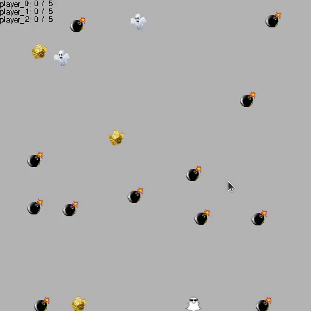

[](https://opensource.org/licenses/MIT)
# BomberManAI
MARL Environment - Multi Agent Reinforcement Learning Environment 

BomberManAI is an implementation of a simplified version of the classic game. 
Here walls are not used and there are no special events/powers for players. 
Your goal is to collect as many coins as you can. 
At the same time, you have to avoid bombs that can harm the player by taking away coins.
You can use bombs to hurt your opponent and decrease his score. 
The limit of game is number of episodes or score limit. 
The winner is the player who has collected the most coins.



# Requirements

---
#### Game
```
python == 3.8
pettingzoo == 1.16.0
gym == 0.21.0
pygame == 2.1.0 
```
---
#### For the purpose of training agents 
```
ray == 1.11.0
torch == 1.11.0
```
## Parameters setting
```
./game/config.py
```
In above file you can find all game settings. You can manipulate them to adjust
the environment.

## Examples
```python
from src.examples.manual_policy import manual_policy
manual_policy()
    
from src.examples.manual_control import manual_control
manual_control()

from src.examples.random_simulation import random_simulation
random_simulation()
```


